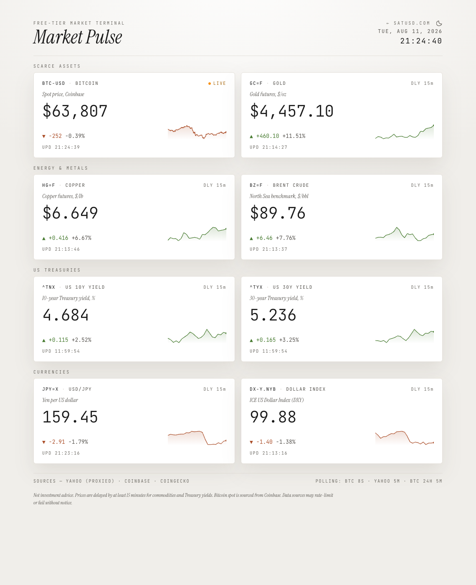

# Market Pulse

A zero-config, browser-only dashboard showing eight financial instruments organized into four categories:



| Category | Instrument | Source | Freshness |
|---|---|---|---|
| **Scarce Assets** | Bitcoin (`BTC-USD`) | Coinbase spot + CoinGecko 24h history | **Live** (8s polling) |
| **Scarce Assets** | Gold (`GC=F`) | Yahoo Finance (proxied) | ~15 min delayed |
| **Energy & Metals** | Copper (`HG=F`) | Yahoo Finance (proxied) | ~15 min delayed |
| **Energy & Metals** | Brent Crude (`BZ=F`) | Yahoo Finance (proxied) | ~15 min delayed |
| **US Treasuries** | US 10Y Yield (`^TNX`) | Yahoo Finance (proxied) | ~15 min delayed |
| **US Treasuries** | US 30Y Yield (`^TYX`) | Yahoo Finance (proxied) | ~15 min delayed |
| **Currencies** | USD/JPY (`JPY=X`) | Yahoo Finance (proxied) | ~15 min delayed |
| **Currencies** | US Dollar Index (`DX-Y.NYB`) | Yahoo Finance (proxied) | ~15 min delayed |

No backend, no API keys, no auth. Deploys as static files to Netlify, Vercel, GitHub Pages, or Cloudflare Pages.

## Run

```bash
npm install
npm run dev      # http://localhost:5173
npm run build    # static bundle in dist/
npm run preview  # serve dist/
```

## Live vs delayed

Bitcoin is fetched directly from Coinbase's public spot endpoint (CORS-enabled) and refreshes every 8 seconds. The 24-hour reference price and sparkline for BTC come from CoinGecko, refreshed every 5 minutes.

Copper, Brent crude, Treasury yields (10Y/30Y), gold, USD/JPY, and the US Dollar Index come from Yahoo Finance's unofficial chart endpoint. Yahoo does not send `Access-Control-Allow-Origin`, so the request is proxied. The data is 15-minute delayed, so each symbol is polled every 5 minutes and the seven fetches are staggered ~400ms apart to stay under the free proxies' per-IP burst limits.

## CORS proxy caveat

Yahoo sends no CORS headers, so its requests must be proxied. The primary proxy is a **self-hosted Cloudflare Worker** (source and one-command deploy in `worker/`): it forwards only Yahoo's v8 chart endpoint, adds CORS headers, and caches responses at the edge for 2 minutes so all visitors share one Yahoo fetch per symbol. The free Workers tier (100k requests/day) is far more than this dashboard can use.

The deployed worker is **origin-locked**: it answers requests from satusd.com and from localhost (so `npm run dev` of any clone gets the fast path), and 403s everything else. A *deployed* fork therefore falls through to the public proxies until you deploy your own worker (below) — edit `ALLOWED_ORIGINS` in `worker/index.js` to your own domain.

The free public proxies remain in the rotation as fallback, so a fresh clone works without deploying anything — but don't count on them alone: `corsproxy.io`'s free tier now serves **only localhost/dev origins** (it 403s in production as of mid-2026), `api.allorigins.win/raw` is valid but often slow (10–20s) or 5xx, and `api.codetabs.com` gets throttled by Yahoo's edge. Resilience comes from layering:

- **Rotation** — each request tries the proxies in order (worker first), validating the JSON *inside* the loop so a proxy that answers `200` with junk (an HTML interstitial, "Edge: Too Many Requests") falls through to the next instead of poisoning the tile.
- **Per-attempt timeout** — each proxy attempt is capped at 8s (`AbortController`) so one stalled proxy can't hold up the tick.
- **Retry** — if a full rotation fails, the fetcher pauses ~700ms and runs the rotation once more, which clears most transient single-tick failures.

**Deploying your own worker** (recommended for forks): `cd worker && npx wrangler deploy` (needs a free Cloudflare account), then replace the first entry of the `PROXIES` array in `src/lib/fetchers.ts` with your worker's URL plus `/?url=`. The rotation lives in `fetchYahooOnce`; the retry wrapper is `fetchYahoo`.

(See `SPEC.md` §9 for other contingencies — Yahoo crumb/cookie requirements, CoinGecko rate limits, etc.)

## Error handling

Each tile manages its own loading and error state. A failure in one fetch never affects another tile. When a Yahoo tile that has already loaded hits a transient failure, it keeps showing its last good price — the `UPD` timestamp reveals how stale it is — rather than blanking to "fetch failed". Only a tile that has *never* loaded shows the error state. Disconnecting the network keeps the last values frozen (timestamps stop advancing); reconnecting refreshes them on the next successful tick.

The last good quote for each Yahoo tile is also persisted to `localStorage`, so on a cold page load the tiles immediately show the previous session's prices (honestly stale, per their `UPD` timestamps) while the first fetch is in flight — and a visitor only ever sees "fetch failed" if every proxy fails on a browser that has never successfully loaded that tile.

## Layout

- Centered, max-width 980px (stacked); widens to ~1520px on large desktops
- 4 categorized sections (Scarce Assets, Energy & Metals, US Treasuries, Currencies), 2 tiles each, each framed by a hairline box so category boundaries stay visible
- Header (clock + date + theme toggle), source/disclaimer footer
- **Responsive:** each section is a two-column grid that collapses to a single stacked column at ≤640px (page/tile padding tightens, the title scales fluidly with `clamp`, readable down to ~320px). Sections stack vertically at every width, so desktop never shows more than two tiles per row. The breakpoint lives in `src/styles.css` (`.tile-grid`, `.app-shell`, `.app-frame`, `.section-box`, `.tile`).
- Aesthetic target: refined Bloomberg terminal, not crypto-bro dashboard

## Theming

Light by default, dark via the moon/sun toggle in the header. The palette is shared with [satusd.com](https://satusd.com/) — the tokens live as CSS custom properties in `src/styles.css` (`:root` light, `:root[data-theme="dark"]` dark). The choice persists in `localStorage` under the `theme` key, the same one satusd.com uses, so when the dashboard is served at `satusd.com/market-pulse` the preference carries across both pages. An inline script in `index.html` applies the saved theme before first paint to avoid a flash. OS `prefers-color-scheme` is deliberately ignored, matching satusd.com.

## Deploying as a sub-route

By default, `npm run build` produces a root-relative bundle that drops onto any static host (Netlify, Vercel, GitHub Pages, Cloudflare Pages) and works at the domain root.

If you need to serve the dashboard from a sub-path instead — e.g. `example.com/market-pulse/` — use:

```bash
npm run build:satusd
```

That builds with Vite's `--base=/market-pulse/` so asset URLs resolve under the sub-path. Copy the resulting `dist/` into your host's `market-pulse/` directory.

This repo also ships a `.github/workflows/deploy-satusd.yml` Action that builds and pushes the output to `saubyk/satusd.com`. It is specific to the satusd.com deploy and is irrelevant to other forks — feel free to delete it if you're using market-pulse elsewhere.

## Disclaimer

Not investment advice. Prices are delayed by at least 15 minutes for commodities and Treasury yields. Bitcoin spot is sourced from Coinbase. Data sources may rate-limit or fail without notice.
